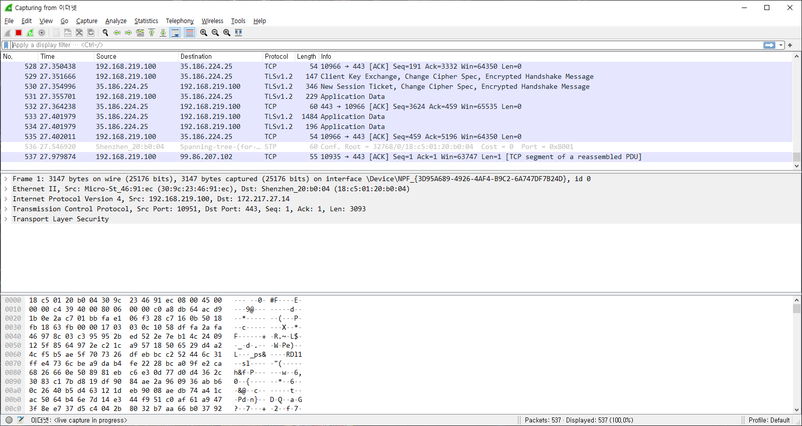

- pcap을 이용하여 패킷을 잡아내는 **오픈소스 패킷 분석 프로그램**

- Window, Linux, Unix 등의 운영체제에서도 사용 가능

- 무차별 모드 ( promiscuous mode ) : broadcast나 multicast traffic 정보도 얻을 수 있음

  - 나에게 들어오고 나가는 패킷에 대한 정보
  - 나에게 들어오고 있지 않은 패킷에 대한 정보 ( 스니핑? )

- 사용 예시

  - 나에게 들어오는 패킷에 대한 정보를 확인할 수 있음
  - pcap library를 이용하여패킷 분석 프로그램을 제작할 수 있음
  - 패킷 복호화 등을 통한 해킹 / 보안 활동을 할 수 있음

- 화면 예시

  

## 패킷 정보

- 패킷 정보에 대한 용어 설명
  - No. : 패킷을 수집한 순서
  - Time : 패킷을 수집한 시간
  - Source : 패킷 시작 주소
  - Destination : 패킷 도착 주소
  - Protocol : 프로토콜 정보
  - Length : 패킷 길이
  - Info : 패킷 정보
- 패킷 에러
  - 에러가 있는 경우 빨간색 / 검은색 등으로 표시될 수 있음 ( 이건 색상 변경가능 )
- 패킷 수집 방법 : wireshark 실행 후 "이더넷" 선택 ( 패킷이 어디서 움직이는지 확인하고 선택할 것 )
- 패킷 수집 시작 / 중지 / 재시작 버튼이 있음

## 패킷 필터링

- 수집 문제점 : **들어오고 나가는 모든 패킷이 수집되고 있음**
- 필터링 방식
  - 캡쳐필터 : 패킷 수집 자체에 필터링을 걸어 적용된 패킷만을 보는 방법 ( 성능에 영향이 갈 수 있음 )
  - 디스플레이 필터 : 패킷 전체를 수집한 후 필터링을 걸어 적용된 패킷만을 보는 방법
- 필터링 방법
  - 상단바에 "Apply a display filter" 공간에 원하는 필터링 방식을 적용
    - 특정 키워드만 입력해도 필터 예시를 알려줌
  - 또는 상단 메뉴바에 "Analyze" -> "Display filters" 버튼 클릭하여 설정
- 필터링 식 예시
  - `eth.addr == 00:3f:1e:00:00:23` : 출발지나 목적지의 MAC 주소로 검색
  - `ip.addr == 192.168.0.2` : 출발지나 목적지의 ip 주소로 검색
  - `tcp.port == 3306` : TCP 출발지나 목적지 port로 검색
  - `ip.src != 10.1.2.3` : 출발지 ip 주소가 해당 ip 주소가 아닌 것으로 검색
  - `eth.dst == 00:3f:1e:00:00:23` : 목적지의 MAC 주소로 검색
- 패킷들을 세션별로 조립해서 내용을 확인할 수도 있음 ( TODO : <u>아직 해보지 못했음</u> )

